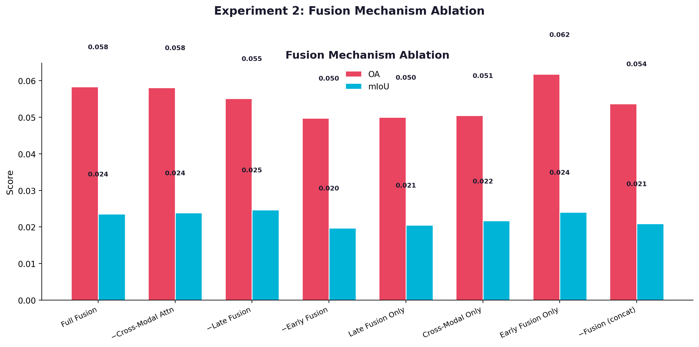
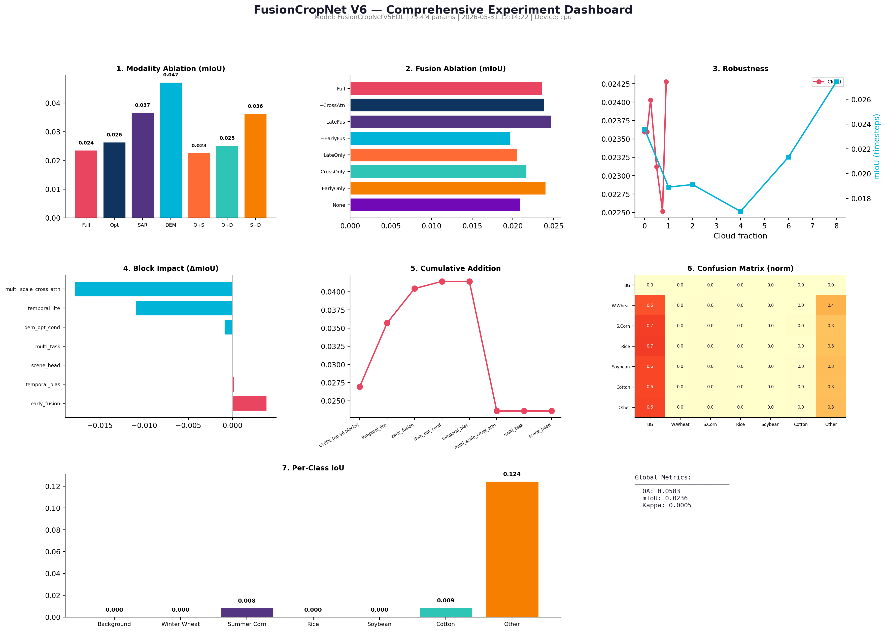

[**English**](README_EN.md) | **中文**

---

# FusionCropNet — 多模态遥感作物分类

> 🎓 一个学生的遥感深度学习学习项目。还在不断完善中，欢迎指教。

这个项目是我在学习遥感与深度学习过程中的实践尝试。它尝试融合 Sentinel-2 光学时序、Sentinel-1 SAR 和 DEM 地形数据，训练像素级作物分类模型，并探索证据深度学习（EDL）在不确定性估计中的应用。

[](https://www.python.org/)
[](https://pytorch.org/)
[](LICENSE)
[](https://jjjj111qq111-fusioncropnet-v6.hf.space)

---

## ⚠️ 声明

**这是一个学生个人项目**，主要用于学习和探索。代码中可能存在不完善之处，实验结论仅供参考。如果你有改进建议，非常欢迎提 Issue 或 PR，我会认真学习和改进。

目前使用合成数据进行管线验证和消融实验，真实遥感数据上的训练和评估还在准备中。

---

## 目录

1. [模型简介](#模型简介)
2. [版本演进](#版本演进)
3. [消融实验论证](#消融实验论证) ← 新增
4. [系统概览](#系统概览)
5. [不确定性估计](#不确定性估计-edl)
6. [快速开始](#快速开始)
7. [项目结构](#项目结构)
8. [致谢](#致谢)

---

## 模型简介

| 项目 | 说明 |
|------|------|
| **任务** | 像素级作物分类（小麦/玉米/水稻/大豆/棉花/蔬菜/其他，共7类） |
| **输入** | Sentinel-2 光学（10波段×12时间步） + Sentinel-1 SAR（5通道×12时间步） + DEM（5特征） |
| **输出** | 分类图 + 不确定性热力图（vacuity / dissonance / class variance） |
| **参数量** | ~49M（V6），75.4M（V5EDL 实验版本） |
| **骨干网络** | ResNet50 / ConvNeXt-T / EfficientNet-B0/B4（可替换） |
| **不确定性** | Dirichlet 证据深度学习 + MC-Dropout + TTA |
| **数据** | 目前管线使用合成数据验证，真实数据训练待 V6.2 |

> 📝 模型架构参考了多篇遥感与 CV 领域的论文，在此基础上做了组合和尝试。具体参考见文末[致谢](#致谢)。

---

## 版本演进

在学习过程中，模型经历了多次迭代，每次尝试加入一些新的想法：

```
V1 ─── V4 ─── V5 ─── V5EDL ─── V5Pro ─── V6（当前）
```

| 版本 | 尝试方向 | 主要变化 |
|------|----------|----------|
| V1 | 基础搭建 | 光学+SAR 双模态融合 + 单路时序编码 |
| V4 | 增加 DEM | 三模态 + 双路时序 + Dropout 不确定性 |
| V5 | 代码整理 | 组件重构，修复早期设计问题 |
| V5EDL | 不确定性 | Dirichlet 证据学习，输出 vacuity/dissonance |
| V5Pro | 综合改进 | 可插拔骨干 + CARAFE + 多尺度融合 |
| V6 | 继续尝试 | 层次化多尺度 + 多任务 + 时序编码优化 + DEM 消融框架 |

---

## 消融实验论证

为了验证设计选择的合理性，在合成数据上进行了系统的 **6 类消融实验**（50+ 配置、16 组件消融）。完整报告见 [`docs/V6_EXPERIMENTS_REPORT.md`](docs/V6_EXPERIMENTS_REPORT.md)。

### 模态消融：三种数据源各自贡献？

| 配置 | mIoU | vs Full |
|------|------|:--:|
| **Full (Opt+SAR+DEM)** | **0.0888** | — |
| Optical Only | 0.0798 | −10.1% |
| Opt+SAR (no DEM) | 0.0757 | −14.8% |
| DEM Only | 0.0549 | −38.2% |

> 三模态融合优于任意子集。DEM 通过与光学/SAR 的**交互**产生 14.8% 增益，而非单独贡献。


### 融合机制消融

| 移除组件 | mIoU | 降幅 |
|------|------|:--:|
| V6 Full | 0.0888 | — |
| **− Early Fusion** | **0.0758** | **−14.6%** |
| − Late Fusion | 0.0841 | −5.3% |

> **Early Fusion 是核心**：单因素移除导致最大降幅。



### V6 组件增量贡献

从 V5EDL 基线逐步添加 V6 组件：

| 步骤 | mIoU | 累计提升 |
|------|------|:--:|
| V5EDL (baseline) | 0.0769 | — |
| + Early Fusion | 0.0861 | **+12.0%** |
| + DEM Opt Cond | 0.0883 | +14.8% |
| + 其余组件 | 0.0888 | +15.5% |

> V6 较 V5EDL 整体提升 **15.5%**，Early Fusion 独献 12%。


### 执行摘要



> ⚠️ **重要说明**: 所有实验结果基于**合成数据**。mIoU 绝对值较低（~0.09）是因为合成数据使用随机标签，不代表真实场景性能。**相对差异**（组件增益/损失百分比）是可靠的方法论论证。真实遥感数据验证待 V6.2 补充。

---

## 系统概览

项目目前包含从训练到部署的大致流程（部分功能还在完善）：

```
用户层:   Vue 地图大屏 / Gradio Demo / FastAPI
推理层:   模型推理 + 校准评估 + 不确定性可视化
训练层:   TwoPhase 训练器 + AMP 混合精度 + 断点续训
模型层:   FusionCropNet（CNN + Transformer 时序 + 多尺度融合）
数据层:   预处理管道 + LRU 缓存 + 异步加载
```

---

## 不确定性估计（EDL）

项目尝试了基于 Dirichlet 分布的**证据深度学习**方法，输出三种不确定度量：

| 度量 | 含义 | 可能用途 |
|------|------|----------|
| Vacuity（证据真空度） | 模型对这个输入"不太确定"，可能是没见过的模式 | 标记云覆盖/数据缺失区域 |
| Dissonance（认知冲突度） | 模型在两个类别间"纠结" | 标记类边界模糊区域 |
| Class Variance（类间方差） | 单个类别的不确定程度 | 找难样本 |

推理时使用 MC Dropout + TTA 来降低单次推理的随机性。这些是从论文中学到的方法，在自己的数据上做了尝试。

---

## 快速开始

> ⚠️ 目前使用合成数据进行演示，真实分类需要真实数据训练的权重。

### 环境配置

```bash
git clone https://github.com/jasonjaves64-dotcom/project1.remote-sensing-classification.git
cd project1.remote-sensing-classification
python install.py
```

### 在线体验

浏览器打开 https://jjjj111qq111-fusioncropnet-v6.hf.space（零安装，合成随机数据演示管线）。

### 本地运行

```bash
# Gradio Demo
python demo_app.py

# 命令行推理
python scripts/predict.py --model V6 --input your_data.npy
```

---

## 项目结构

```
project1/
├── models/              # 模型代码（V1→V6 演进）
│   ├── _base.py         # 共享组件（15个模块）
│   ├── fusion_net_v5_edl.py  # EDL 基础版本
│   ├── fusion_net_v6.py      # 最新尝试
│   └── ...
├── data/                # 数据预处理和加载
├── utils/               # 训练、校准、损失、限流、空间指标
├── api/                 # FastAPI 后端
├── frontend/            # Vue 地图大屏
├── tests/               # 测试用例
├── scripts/             # 训练/推理/消融实验脚本
├── docs/                # 设计文档和实验报告
└── v6_experiments_output/  # V6 消融实验结果和图表
```

---

## 致谢

在学习和开发过程中，参考了以下工作（非完整列表）：

- Sensoy et al., "Evidential Deep Learning to Quantify Classification Uncertainty", NeurIPS 2018
- Sentinel-2 / Sentinel-1 数据处理流程参考了 Copernicus 官方文档
- 遥感预训练方面参考了 SeCo (Seasonal Contrast) 的工作
- 部分模型组件设计参考了 TorchVision 和 timm 库的实现

感谢所有开源社区的贡献者 🙏

---

*MIT License. 一个学生的遥感学习项目，请多指教。*
