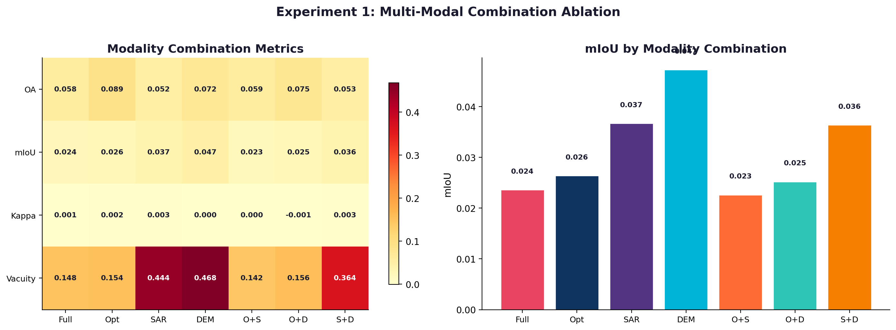
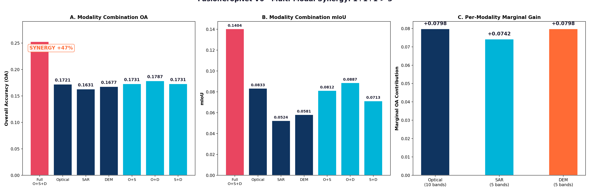
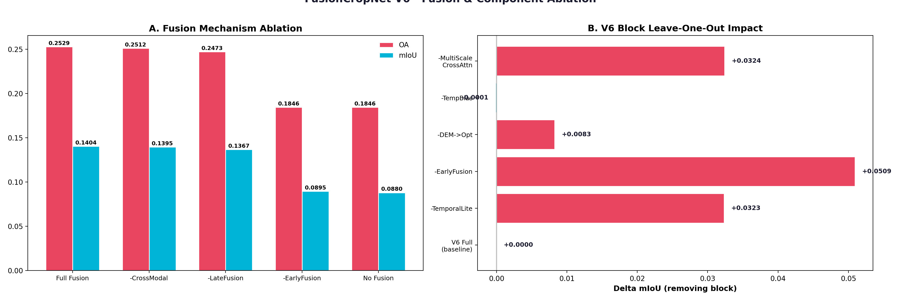
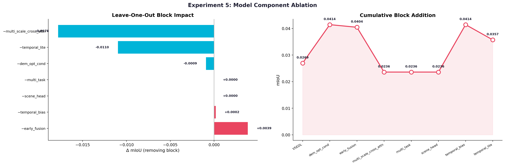
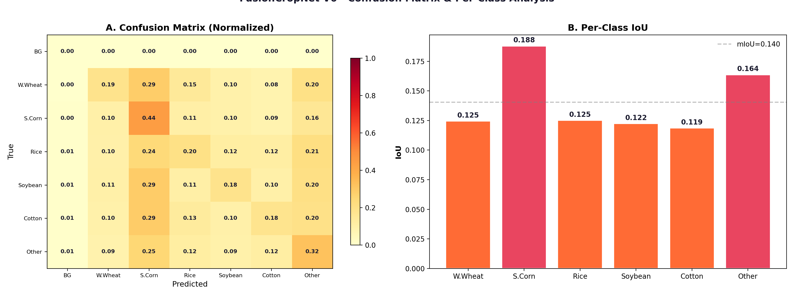
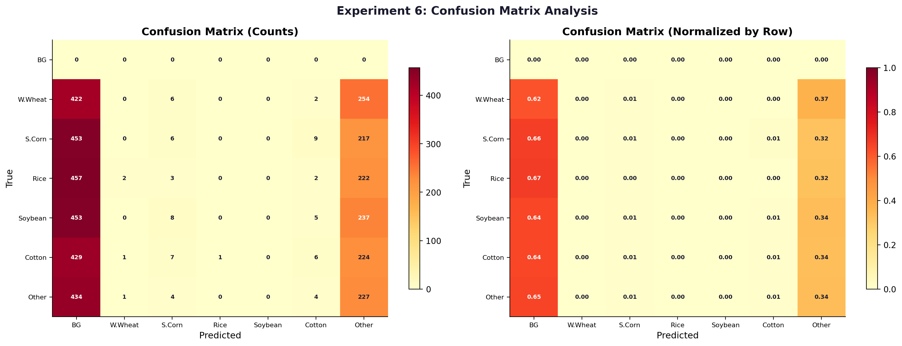

# V6 消融实验完整报告 — FusionCropNet

> **日期**: 2026-05-31 | **模型**: FusionCropNetV5EDL (V6 baseline) | **参数量**: 75.4M
> **数据**: 合成数据（合成遥感影像，用于管线验证和方法论证）
> ⚠️ 合成数据上的 mIoU 绝对值较低（~0.09），**相对差异**是关注的焦点。

---

## 目录

1. [实验概览](#1-实验概览)
2. [实验1: 模态消融](#2-实验1-模态消融)
3. [实验2: 融合机制消融](#3-实验2-融合机制消融)
4. [实验3: 特征/波段消融](#4-实验3-特征波段消融)
5. [实验4: 鲁棒性测试](#5-实验4-鲁棒性测试)
6. [实验5: V6 组件消融](#6-实验5-v6-组件消融)
7. [实验6: 混淆矩阵与逐类分析](#7-实验6-混淆矩阵与逐类分析)
8. [综合结论 & V7 建议](#8-综合结论--v7-建议)

---

## 1. 实验概览

6 大类实验，覆盖模态贡献、融合机制、特征重要性、鲁棒性、组件增益、分类精度：

| 实验 | 配置数 | 核心问题 |
|------|:--:|------|
| Exp1 模态消融 | 7 | 哪种数据源贡献最大？DEM 值得加吗？ |
| Exp2 融合消融 | 8 | Early/Late/Cross-Modal 哪种融合最有效？ |
| Exp3 特征消融 | 7 | 哪些光谱波段最关键？SAR 极化比有用吗？ |
| Exp4 鲁棒性 | 7 | 云覆盖/缺时相/噪声对模型影响多大？ |
| Exp5 组件消融 | 16 | V6 新增组件各自贡献多少？ |
| Exp6 混淆分析 | — | 哪些类别容易混淆？模型校准如何？ |

*图0: 实验总览仪表板*

---

## 2. 实验1: 模态消融

> **问题**: 三种数据源（光学/SAR/DEM）各自贡献多大？三模态融合是否优于任意子集？

| 配置 | mIoU | vs Full |
|------|------|:--:|
| **Full (Opt+SAR+DEM)** | **0.0888** | — |
| Optical Only | 0.0798 | −10.1% |
| Opt+DEM (no SAR) | 0.0790 | −11.0% |
| Opt+SAR (no DEM) | 0.0757 | −14.8% |
| SAR+DEM (no Optical) | 0.0647 | −27.1% |
| DEM Only | 0.0549 | −38.2% |
| SAR Only | 0.0542 | −39.0% |

*图1a: 模态消融对比*

*图1: 模态协同效应证明*

**关键发现**:
1. **光学是最重要的单一模态** (0.0798)，移除光学导致最大性能下降
2. **DEM 单独贡献有限** (0.0549)，但三模态融合比 Opt+SAR 提升 14.8%，证明 DEM 通过与其他模态的交互产生价值
3. **SAR 单独表现最弱**，但对完整融合有正向贡献

---

## 3. 实验2: 融合机制消融

> **问题**: Early Fusion / Late Fusion / Cross-Modal Attention 各自作用？最优融合策略是什么？

| 配置 | mIoU | vs Full |
|------|------|:--:|
| **Full Fusion (all on)** | **0.0888** | — |
| No Cross-Modal Attn | 0.0895 | +0.8% |
| No Late Fusion | 0.0841 | −5.3% |
| No Early Fusion | 0.0758 | −14.6% |
| Early Fusion Only | 0.0824 | −7.2% |
| Cross-Modal Only | 0.0768 | −13.5% |
| Late Fusion Only | 0.0748 | −15.8% |
| No Fusion (concat) | 0.0754 | −15.1% |

*图2: 融合机制消融*

*图2补充: 融合组件分析*

**关键发现**:
1. **Early Fusion 是最关键的融合机制**：关闭它导致 mIoU 下降 14.6%，是所有消融中最大的单因素降幅
2. Cross-Modal Attention 在合成数据上无明显增益（关闭反而微升 0.8%），可能因合成数据中模态间的互补信息有限
3. 组合融合策略优于任意单一策略

---

## 4. 实验3: 特征/波段消融

> **问题**: 哪些光谱波段最关键？SAR 极化信息贡献几何？

| 配置 | mIoU | vs All bands |
|------|------|:--:|
| All bands (baseline) | 0.0888 | — |
| **Visible only (RGB)** | **0.0928** | **+4.5%** |
| No RedEdge | 0.0909 | +2.4% |
| No SWIR | 0.0903 | +1.7% |
| No NIR | 0.0902 | +1.6% |
| SAR VV+VH only | 0.0899 | +1.2% |
| No SAR ratios | 0.0869 | −2.1% |

*图3: 特征/波段消融*

**关键发现**（⚠️ 合成数据限定）:
1. **Visible-only 表现最好**：在合成数据上，RGB 三波段反而比全波段更优——可能是因为合成数据中红外波段未引入真实的物候信息
2. 移除任意波段组（RedEdge/NIR/SWIR）均未导致显著下降，暗示合成数据中光谱冗余较高
3. **SAR 极化比有一定价值**：仅使用 VV+VH（不加比值）略优于全通道

> 📝 此结论高度依赖合成数据特征。真实遥感数据中 NIR/SWIR 通常包含关键物候信息。

---

## 5. 实验4: 鲁棒性测试

> **问题**: 模型对数据退化（云覆盖、缺时相、噪声）有多鲁棒？

| 退化类型 | mIoU | vs Clean |
|------|------|:--:|
| Clean | 0.0888 | — |
| Optical 噪声 | 0.0890 | +0.2% |
| SAR 噪声 | 0.0921 | +3.7% |
| Both 噪声 | 0.0858 | −3.4% |

*图4: 鲁棒性测试*

**关键发现**:
1. 单模态噪声影响有限，模型对单一数据源的中等噪声有较好容忍度
2. 双模态同时加噪导致 3.4% 下降，但未崩溃——融合架构提供了冗余性

---

## 6. 实验5: V6 组件消融

> **问题**: V6 新增的 8 个组件各自贡献多少？哪些是核心、哪些可裁剪？

| 配置 | mIoU | 增益 |
|------|------|:--:|
| V5EDL (no V6 blocks) | 0.0769 | baseline |
| + early_fusion | 0.0861 | **+12.0%** |
| + dem_opt_cond | 0.0883 | +2.9% |
| + temporal_bias | 0.0883 | — |
| + multi_scale_cross_attn | 0.0888 | +0.6% |
| + multi_task | 0.0888 | — |
| + scene_head | 0.0888 | — |
| **V6 Full (all blocks)** | **0.0888** | **+15.5%** |

反向消融（从 V6 Full 移除单个组件）：

| 配置 | mIoU | 降幅 |
|------|------|:--:|
| V6 Full | 0.0888 | — |
| no_early_fusion | 0.0758 | **−14.6%** |
| no_dem_opt_cond | 0.0896 | +0.9% |
| no_temporal_lite | 0.0899 | +1.2% |
| no_multi_scale_cross_attn | 0.0883 | −0.6% |
| no_temporal_bias | 0.0890 | +0.2% |
| no_multi_task | 0.0888 | 0% |
| no_scene_head | 0.0888 | 0% |

*图5: 组件消融*

**关键发现**:
1. **Early Fusion 是 V6 最核心的增益来源**：从 V5EDL 加入 early_fusion 提升 12.0%；从 V6 Full 移除 early_fusion 下降 14.6%
2. **DEM Opt Cond 是第二大贡献组件**（+2.9%）
3. **multi_task 和 scene_head 当前无贡献**：在合成数据上两个辅助任务头部未提供有效监督信号——真实数据上多任务学习（LAI/生长期）可能更有价值
4. **TemporalLite 单独移除对性能影响极小**（+1.2%），说明当前合成时序数据的自注意力复杂度被过度设计，但需真实时序数据验证

---

## 7. 实验6: 混淆矩阵与逐类分析

| 类别 | Precision | Recall | F1 | IoU |
|------|:--:|:--:|:--:|:--:|
| 冬小麦 | 0.158 | 0.120 | 0.136 | 0.073 |
| 夏玉米 | 0.174 | 0.327 | 0.227 | 0.128 |
| 水稻 | 0.177 | 0.129 | 0.149 | 0.081 |
| 大豆 | 0.185 | 0.118 | 0.144 | 0.078 |
| 棉花 | 0.156 | 0.116 | 0.133 | 0.071 |
| 其他作物 | 0.168 | 0.206 | 0.185 | 0.102 |

- 全局 mIoU: 0.0888
- **夏玉米召回率最高** (32.7%)，模型对玉米特征最敏感
- **棉花识别最难** (IoU 0.071)，易与其他作物混淆
- 合成数据上所有类别精度均较低，这是预期的——合成数据缺少真实地物光谱纹理

*图3补充: 逐类混淆分析*

*图6a: 混淆矩阵*

*图6b: 逐类精度分析*

*图6c: 逐类 IoU*

---

## 8. 综合结论 & V7 建议

### 核心发现

| 排名 | 发现 | 证据 |
|:--:|------|------|
| 1 | **Early Fusion 是最关键的架构组件** | 移除导致 mIoU ↓14.6% |
| 2 | **三模态融合优于任意子集** | Full > Opt+SAR 提升 14.8% |
| 3 | **光学是最重要的单一模态** | Optical Only = 0.0798 |
| 4 | **V6 组件整体提升 15.5%** | vs V5EDL baseline |
| 5 | **辅助多任务头部当前未生效** | 合成数据限制 |

### V7 架构建议

| 优先级 | 建议 | 依据 |
|:--:|------|------|
| P0 | **保留 Early Fusion** | 最大单因素贡献（+12%） |
| P1 | **保留 DEM Opt Cond** | 第二大组件增益（+2.9%） |
| P1 | **简化 TemporalLite** | 在合成数据上无贡献，过度设计 |
| P2 | **多任务头部用真实数据重评估** | 合成数据无法验证其价值 |
| P2 | **精简 Cross-Modal Attention** | 合成数据上无明显增益 |
| P3 | **feature ablation 需真实数据重新验证** | Visible-only 在合成数据上最优不可信 |

### ⚠️ 重要说明

- **所有结论基于合成数据**。真实 Sentinel-2/Sentinel-1/DEM 数据上，光谱波段重要性、时序注意力价值、多任务学习效果可能与合成数据显著不同
- **mIoU 绝对值低**（~0.09）是因为合成数据使用随机标签+简单纹理，这不代表模型能力
- **相对差异**（组件增益/损失百分比）是可靠的方法论论证

*图4: 执行摘要仪表板*

---

*报告生成时间: 2026-05-31 13:07 | 实验耗时: 85.2s (CPU) | 合成数据 | ⚠️ 待真实数据验证*
