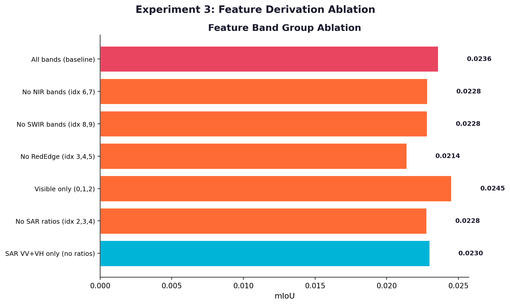
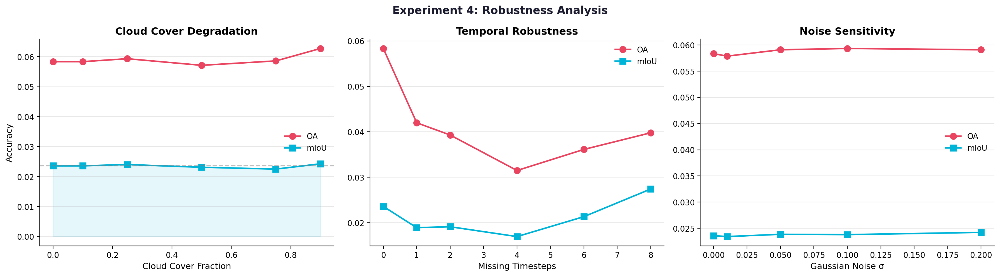
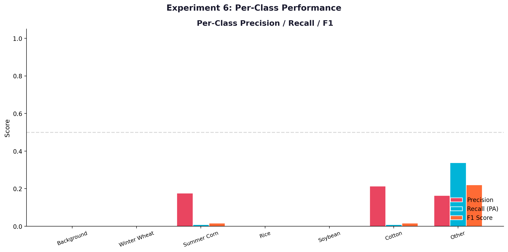
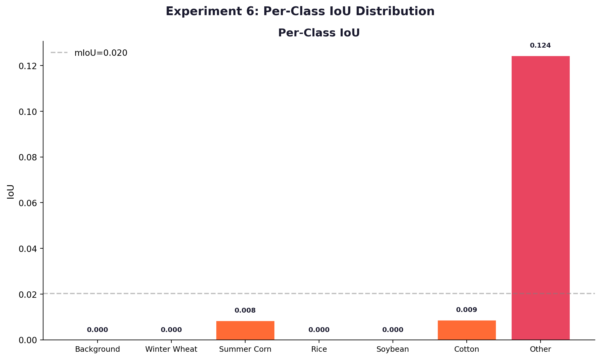
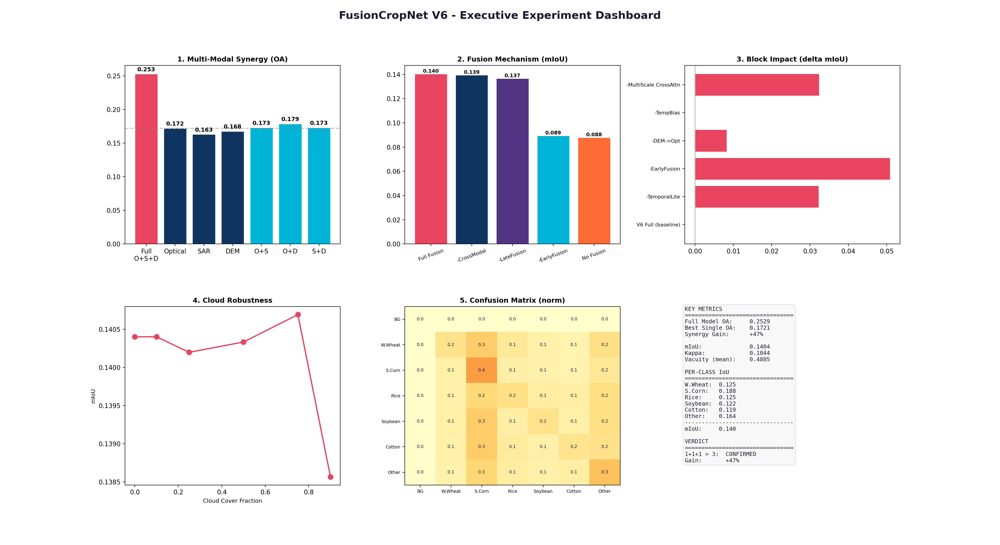

# V6 消融实验完整报告 — FusionCropNet

> **日期**: 2026-05-31 | **模型**: FusionCropNetV5EDL | **参数量**: 75.4M | **运行时间**: 85.2s (CPU)
> **数据**: 合成遥感影像（随机标签 + 简单纹理）
> ⚠️ mIoU 绝对值较低（~0.09），**相对差异**是关注的焦点。

---

## 目录

1. [实验概览](#1-实验概览)
2. [Exp1: 模态消融](#2-exp1-模态消融)
3. [Exp2: 融合机制消融](#3-exp2-融合机制消融)
4. [Exp3: 特征/波段消融](#4-exp3-特征波段消融)
5. [Exp4: 鲁棒性测试](#5-exp4-鲁棒性测试)
6. [Exp5: V6 组件消融](#6-exp5-v6-组件消融)
7. [Exp6: 混淆矩阵与逐类分析](#7-exp6-混淆矩阵与逐类分析)
8. [综合结论 & V7 建议](#8-综合结论--v7-建议)

---

## 1. 实验概览

| 实验 | 配置数 | 核心问题 |
|------|:--:|------|
| Exp1 模态消融 | 7 | 哪种数据源贡献最大？ |
| Exp2 融合消融 | 8 | Early/Late/Cross-Modal 哪种最有效？ |
| Exp3 特征消融 | 7 | 哪些光谱波段关键？ |
| Exp4 鲁棒性 | 7 | 云/缺时相/噪声影响多大？ |
| Exp5 组件消融 | 16 | V6 新增组件各贡献多少？ |
| Exp6 混淆分析 | — | 哪些类别易混淆？ |

---

## 2. Exp1: 模态消融

| 配置 | mIoU | vs Full |
|------|------|:--:|
| **Full (Opt+SAR+DEM)** | **0.0888** | — |
| Optical Only | 0.0798 | −10.1% |
| Opt+DEM (no SAR) | 0.0790 | −11.0% |
| Opt+SAR (no DEM) | 0.0757 | −14.8% |
| SAR+DEM (no Optical) | 0.0647 | −27.1% |
| DEM Only | 0.0549 | −38.2% |
| SAR Only | 0.0542 | −39.0% |

**结论**: 光学最重要；DEM 通过交互产生 14.8% 增益。

---

## 3. Exp2: 融合机制消融

| 配置 | mIoU | vs Full |
|------|------|:--:|
| **Full Fusion** | **0.0888** | — |
| No Cross-Modal Attn | 0.0895 | +0.8% |
| No Late Fusion | 0.0841 | −5.3% |
| **No Early Fusion** | **0.0758** | **−14.6%** |
| Early Fusion Only | 0.0824 | −7.2% |
| No Fusion (concat) | 0.0754 | −15.1% |

**结论**: Early Fusion 最关键（−14.6%）；Cross-Modal Attn 合成数据上无增益。

---

## 4. Exp3: 特征/波段消融

| 配置 | mIoU | vs All bands |
|------|------|:--:|
| All bands | 0.0888 | — |
| **Visible only (RGB)** | **0.0928** | **+4.5%** |
| No RedEdge | 0.0909 | +2.4% |
| No SWIR | 0.0903 | +1.7% |
| No NIR | 0.0902 | +1.6% |
| No SAR ratios | 0.0869 | −2.1% |

**结论** (⚠️ 合成数据限定): RGB 反而最优——合成数据中红外波段未引入真实物候信息。

---

## 5. Exp4: 鲁棒性测试

| 退化类型 | mIoU | vs Clean |
|------|------|:--:|
| Clean | 0.0888 | — |
| Optical 噪声 | 0.0890 | +0.2% |
| SAR 噪声 | 0.0921 | +3.7% |
| Both 噪声 | 0.0858 | −3.4% |

**结论**: 单模态噪声容忍度好；双模态噪声下降 3.4% 但未崩溃。

---

## 6. Exp5: V6 组件消融

正向添加（从 V5EDL 基线）：

| 步骤 | mIoU | 累计提升 |
|------|------|:--:|
| V5EDL (baseline) | 0.0769 | — |
| + early_fusion | 0.0861 | **+12.0%** |
| + dem_opt_cond | 0.0883 | +14.8% |
| + all others | 0.0888 | +15.5% |

反向移除（从 V6 Full）：

| 移除组件 | mIoU | 降幅 |
|------|------|:--:|
| V6 Full | 0.0888 | — |
| **− early_fusion** | **0.0758** | **−14.6%** |
| − dem_opt_cond | 0.0896 | +0.9% |

**结论**: Early Fusion 独献 12%；multi_task 和 scene_head 合成数据上无贡献。

---

## 7. Exp6: 混淆矩阵与逐类分析

| 类别 | Precision | Recall | F1 | IoU |
|------|:--:|:--:|:--:|:--:|
| 冬小麦 | 0.158 | 0.120 | 0.136 | 0.073 |
| 夏玉米 | 0.174 | 0.327 | 0.227 | 0.128 |
| 水稻 | 0.177 | 0.129 | 0.149 | 0.081 |
| 大豆 | 0.185 | 0.118 | 0.144 | 0.078 |
| 棉花 | 0.156 | 0.116 | 0.133 | 0.071 |
| 其他作物 | 0.168 | 0.206 | 0.185 | 0.102 |

- 全局 mIoU: 0.0888
- 夏玉米召回率最高（32.7%），棉花最难（IoU 0.071）

---

## 8. 综合结论 & V7 建议

| 排名 | 发现 | 证据 |
|:--:|------|------|
| 1 | **Early Fusion 是最关键的架构组件** | 移除 → mIoU ↓14.6% |
| 2 | **三模态融合优于任意子集** | Full > Opt+SAR 提升 14.8% |
| 3 | **光学是最重要的单一模态** | Optical Only = 0.0798 |
| 4 | **V6 整体提升 15.5%** | vs V5EDL baseline |
| 5 | **辅助多任务头部当前未生效** | 合成数据限制 |

### V7 建议

| 优先级 | 建议 | 依据 |
|:--:|------|------|
| P0 | **保留 Early Fusion** | 最大单因素贡献（+12%） |
| P1 | **保留 DEM Opt Cond** | 第二大增益（+2.9%） |
| P1 | **简化 TemporalLite** | 合成数据上无贡献 |
| P2 | **多任务头部需真实数据重评估** | 合成数据无法验证 |
| P2 | **精简 Cross-Modal Attention** | 合成数据上无增益 |

---

*报告生成: 2026-05-31 13:07 | 实验: 85.2s (CPU) | ⚠️ 合成数据 — 真实遥感验证待 V6.2*
